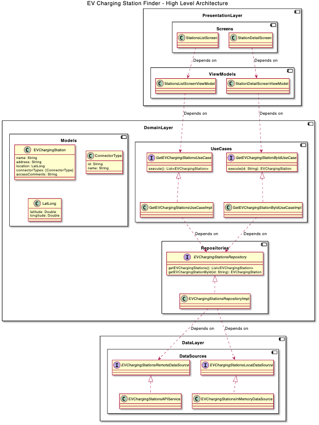

# EV Charging Station Finder

## Overview

A simple list-detail app that displays a list of EV charging stations from OpenChargeMap API and allows the user to select one to view its details.

## Architecture Proposal

The architecture of the application is based on the **MVVM architecture**. The application is divided into three layers: **Data Layer**, **Domain Layer**, and **Presentation Layer**.

> You can see the architecture in the **architecture.puml** file.

### Data Layer

The **Data Layer** is responsible for fetching data from the **OpenChargeMap API**. It is divided into two sublayers: **Data Sources** and **Repositories**.

It also includes a **EVChargingStationsInMemoryDataSource** to store the data in memory. It could be replaced with a **Core Data** or **SQLite** database in the future.

#### Models

The **Models** are the data models that are used to represent the data from the **OpenChargeMap API**.

[JSON4Swift](https://www.json4swift.com/) was used to generate the models from the **OpenChargeMap API**.

### Domain Layer

The **Domain Layer** is responsible for business logic. It is divided into two sublayers: **Use Cases** and **Repositories**.

### Presentation Layer

The **Presentation Layer** is responsible for user interface. It is divided into two sublayers: **ViewModels** and **Views**.
