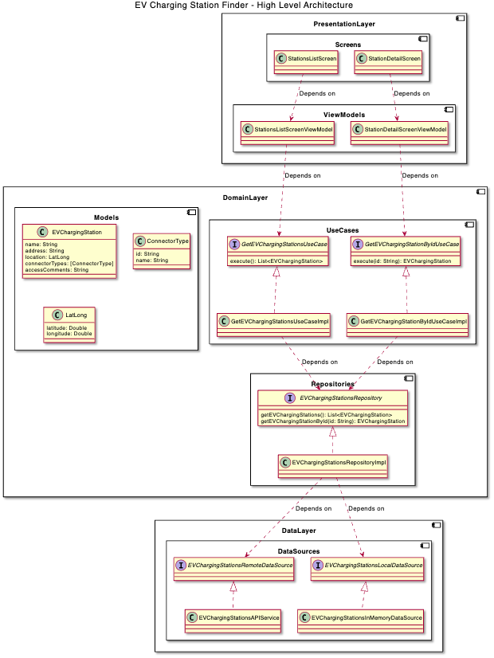

# EV Charging Station Finder

## Overview

This project is a take-home coding challenge to create an iOS application that **displays nearby electric vehicle (EV) charging stations**. The application utilizes the **OpenChargeMap API** (https://openchargemap.org/site/develop/api) to fetch station data.

The primary goal of this exercise is to evaluate the ability to build a **modular and testable iOS application** using an **MVVM/MVP architecture** and adhering to good engineering practices. The project is designed to be a **complete but not necessarily shippable application**, with a suggested time limit of **no more than 10 hours total** (over 2-3 days).

## Key Features

The application is built with the following core features:

*   **Station List Screen**:
    *   Displays a list of nearby EV charging stations.
    *   Each station cell shows its **name, address, and location information**.
    *   Tapping on a cell navigates to a detailed view of the station.

*   **Station Detail Screen**:
    *   Provides **detailed information** about the selected charging station, including **connector types, full address, and access comments**.
    *   **Optional**: Can display the station's location using **MapKit**.

Both screens are designed to follow **standard iOS user interface guidelines**, with choices for fonts, layout, and animations left to the developer's judgment.

## Technical Implementation Highlights

*   **Minimum iOS Version**: iOS 14.
*   **Language**: Developed entirely in **Swift**.
*   **UI Framework**: Built using **SwiftUI**.
*   **UI Construction**: The user interface is **constructed entirely in code**; no Interface Builder or storyboards are used.
*   **Architecture**: Follows an **MVVM architecture** to promote modularity and testability.
*   **Network Integration**: **URLSession** is used for all REST API integration with OpenChargeMap.
*   **Error Handling**: Robust error handling is implemented for network issues and empty data scenarios.
*   **Unit Testing**:
    *   Unit tests are written using **SwiftTesting**.
    *   **View models and networking services** are covered by unit tests.
    *   **Dependency injection** is utilized to enable effective mocking for testing purposes.
*   **Dependency Injection (DI)**:
    *   **Constructor-based injection** is used throughout the application.
    *   Networking components are **abstracted behind protocols** to facilitate testing and reduce coupling.
    *   Emphasis is placed on **avoiding singletons or tightly coupled code**.
*   **No Third-Party Frameworks Required**: The solution does not require any third-party frameworks.

## Important Development Notes

*   **Engineering Decision Journal**: A **DECISION_LOG.md** file (or integrated into this README) is provided, detailing architectural decisions and areas of testing focus. It also describes how AI coding tools/assistants (if any) were integrated into the workflow.
*   **Git Commit History**: The project's Git history reflects **regular, descriptive commits**, mirroring a typical day-to-day development process. This adheres to the requirement of not having a single large commit or no commit history, which would result in automatic disqualification.

## Setup instructions

The app is expecting a **Secrets.xcconfig** file to be present in the root directory of the project. This file should contain the following variables:

*   **OPEN_CHARGE_MAP_KEY**: The API key for the OpenChargeMap API.

Just create a copy of the **Secrets.xcconfig.example** file and rename it to **Secrets.xcconfig**.

Make you to replace the **OPEN_CHARGE_MAP_KEY** value with your own API key.

## Architecture Proposal

The architecture of the application is based on the **MVVM architecture**. The application is divided into three layers: **Data Layer**, **Domain Layer**, and **Presentation Layer**.

> You can see the architecture in the **architecture.puml** file.

### Data Layer

The **Data Layer** is responsible for fetching data from the **OpenChargeMap API**. It is divided into two sublayers: **Data Sources** and **Repositories**.

It also includes a **EVChargingStationsInMemoryDataSource** to store the data in memory. It could be replaced with a **Core Data** or **SQLite** database in the future.

#### Models

The **Models** are the data models that are used to represent the data from the **OpenChargeMap API**.

[JSON4Swift](https://www.json4swift.com/) was used to generate the models from the **OpenChargeMap API**.

### Domain Layer

The **Domain Layer** is responsible for business logic. It is divided into two sublayers: **Use Cases** and **Repositories**.

### Presentation Layer

The **Presentation Layer** is responsible for user interface. It is divided into two sublayers: **ViewModels** and **Views**.